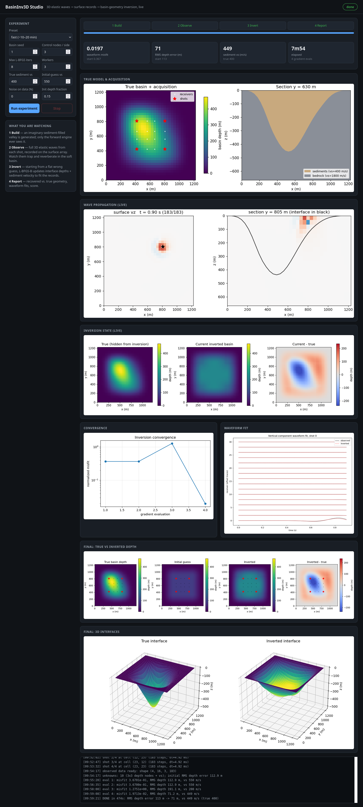
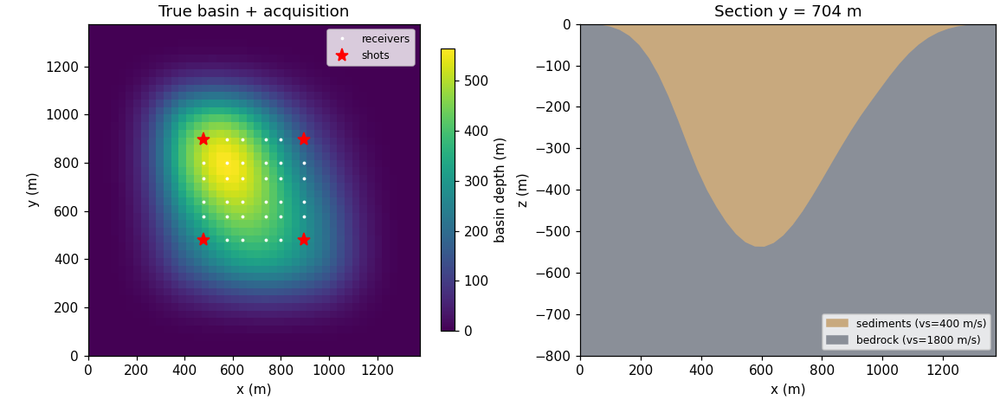
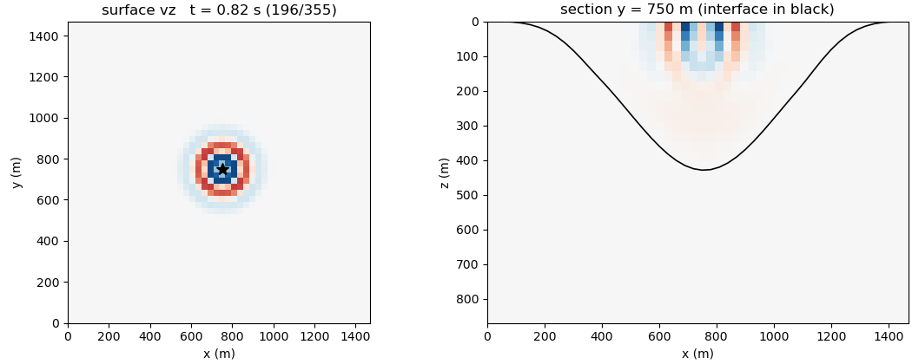
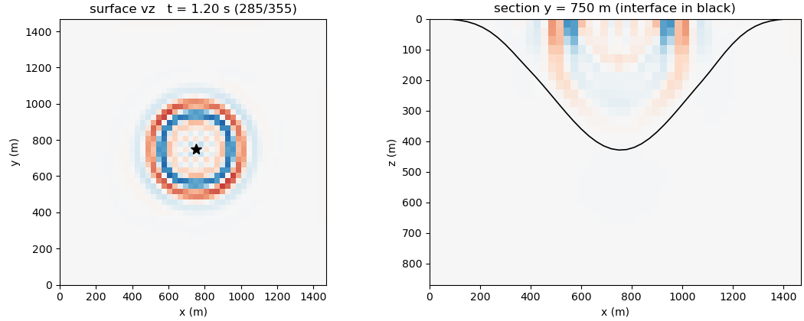
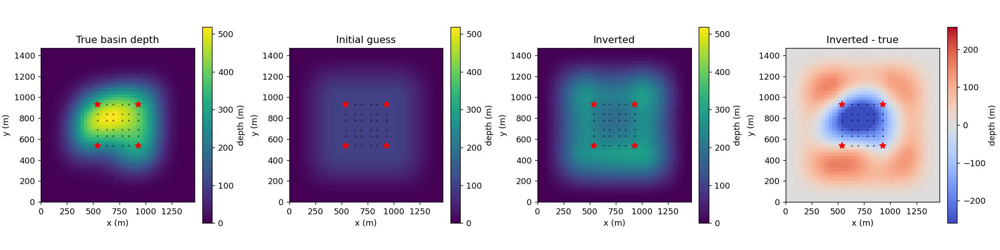
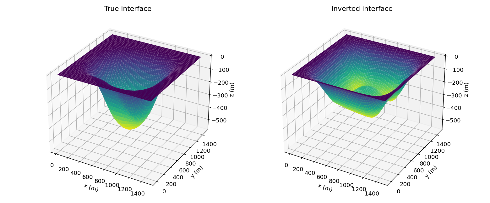
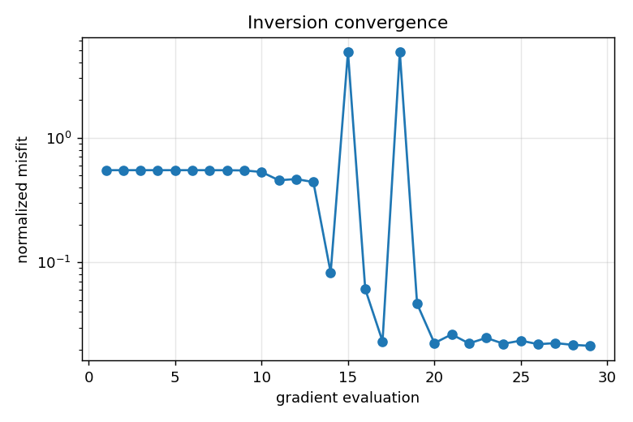
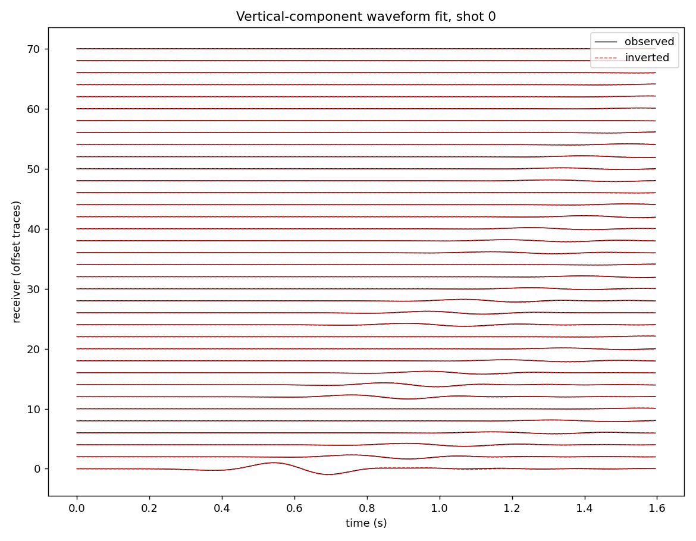
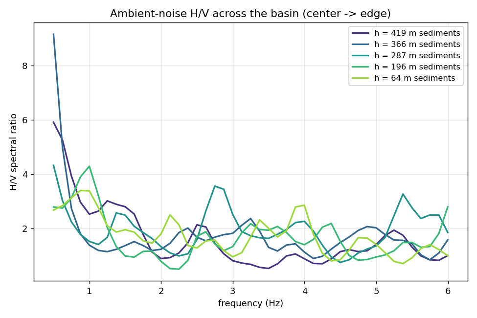

# BasinInv3D

**3D elastic full-waveform inversion of sediment-filled basin geometry — a
synthetic proof-of-concept for going beyond 1D HVSR in sedimentary basins.**

Soft sediments filling a 3D valley trap and amplify seismic waves. The
standard field practice — inverting H/V spectral ratios station by station
with 1D physics and interpolating a bedrock map afterwards — ignores the 3D
basin effects that matter most. BasinInv3D runs the whole problem in 3D:
full elastic wave propagation in a 3D basin model, and **one joint inversion**
of the bedrock–sediment interface `z_b(x, y)` plus the sediment shear
velocity from the surface records of all shots and stations simultaneously.

The experiment is the classic synthetic loop:

1. **Build** an imaginary 3D sediment-filled valley (the "true" model).
2. **Observe**: simulate elastic waves and record them on a surface array.
3. **Invert**: pretending the basin is unknown, recover its geometry and
   velocity from those records, starting from a wrong flat guess.
4. **Score** the recovery against the hidden truth.

## Live web studio

The entire pipeline runs in a browser dashboard that streams every stage
live — the generated basin, each shot's wavefield propagating and
reverberating in the valley, the inverted basin and misfit curve updating
after every gradient evaluation, and a final scored report:

```bash
python3 webapp/app.py           # then open http://127.0.0.1:8642
```



Pick a preset (**fast** ≈ 10–20 min on 4 cores, **standard** ≈ 1–2 h), press
**Run experiment**, and watch. The config panel exposes the basin seed,
control-node count, iteration budget, data noise, and the true/initial
sediment velocities; a Stop button and log console are included. The server
is pure Python stdlib (`http.server`) — no web framework needed.

## The steps in pictures

### 1 — Build: an imaginary valley

A random smooth 3D depression (sum of Gaussians) filled with soft sediments
(here vs = 400 m/s) embedded in stiff bedrock (vs = 1800 m/s), with the
shot/receiver layout on the surface:



### 2 — Observe: 3D elastic waves

A vertical-force Ricker source excites the model; the full 3D
velocity–stress wavefield is marched in time. Left: vertical velocity on
the surface. Right: a vertical section — note the energy guided and
reverberating inside the basin (interface in black):




Three-component seismograms recorded by the surface array become the
"observed data" — the only thing the inversion is allowed to see.

### 3 — Invert: recover the basin

Unknowns: a coarse grid of interface control depths (bicubic-interpolated to
the full surface) **plus** the sediment shear velocity. A normalized
least-squares waveform misfit over all shots/receivers/components is
minimized with L-BFGS-B; gradients come from parallel finite-difference
forwards; a first+second-difference roughness penalty keeps the node grid
from developing checkerboard artifacts.




Convergence and the waveform fit after inversion:

| Convergence | Waveform fit |
|---|---|
|  |  |

**Benchmark** (50×50×30 grid, two-bump basin 519 m deep, 4 shots, 36
three-component receivers, 10 unknowns, flat 101 m / vs = 550 initial
guess): misfit 0.52 → 0.021, sediment vs recovered **395 m/s** (true 400),
RMS depth error 120 → 91 m, no checkerboard. The remaining depth deficit at
the basin center is the regularization/resolution trade-off of a 3×3 node
grid — see the roadmap.

### 4 — Ambient-noise mode (H/V)

For realism closer to microtremor field campaigns, `basininv/noise.py`
simulates many randomly placed, randomly timed sources and extracts H/V
spectral ratios per station. Deep-sediment stations show strong
low-frequency amplification, moving to higher frequency toward the basin
edge — the classic HVSR signature, now available as an alternative data
type for the same inversion machinery:



## Microtremor (HVSR) studio — a second app

A separate companion app inverts **ambient-microtremor H/V curves** from a
scattered set of surface stations into a **3-D multi-layer sediment Vs
structure** — the field-data-oriented counterpart to the active-source FWI
above. It shares the same `basininv` package and stdlib-only server, on its
own port:

```bash
python3 webapp_mt/app.py        # then open http://127.0.0.1:8643
```

Physics (`basininv/hvsr.py`): under each station the earth is a 1-D layered
column; its HVSR is modelled as the ratio of the SH to the P vertical-incidence
surface amplification of a damped layered medium (propagator recursion), whose
fundamental reproduces `f0 = Vs/4H`. One forward is a few matrix recursions over
frequency — milliseconds — so finite-difference gradients over a dense
parameterization are cheap. Sediment layers are parameterized by **thickness**
control-node grids (non-negative, so interfaces never cross) plus per-layer Vs;
**any parameter can be fixed** (known bedrock from boreholes, a fixed Vs jump, a
known layer depth). The inversion matches modelled to observed H/V for all
stations with L-BFGS-B, driven primarily by a peak-frequency term that avoids
HVSR cycle-skipping.

The studio streams the whole loop live in tabbed steps — **Stations & Data**
(microtremor record → H/V curve per station), **Invert** (thickness nodes + Vs),
**Report** (Vs cross-sections, bedrock-depth score, H/V fits) — plus an
interactive **3-D Vs viewer** (stacked interfaces coloured by layer Vs, with the
hidden true bedrock as an overlay) that rebuilds every evaluation. An optional
**uncertainty ensemble** re-runs the inversion across independent noise
realizations, starting models, smoothing strengths *and node resolutions* (the
last is essential — resolution, not measurement noise, dominates HVSR
non-uniqueness) and reports a per-cell bedrock-depth ±σ map; results export to
JSON.

**Benchmark** (3-layer basin, bedrock ≤ 140 m, 25 stations, Vs fixed at truth,
5 % HVSR noise): bedrock-depth RMS 32 → 13 m, depth correlation **0.97**. HVSR
resolves only depths whose fundamental stays in a measurable band (~0.3–10 Hz);
deeper basins, or free multi-layer Vs, need the fixed-parameter constraints.

## Installation

Python ≥ 3.9 with NumPy, SciPy and matplotlib:

```bash
git clone git@github.com:ShahramMgh/BasinInv3D.git
cd BasinInv3D
pip install -r requirements.txt   # numpy scipy matplotlib
```

No compiled extensions, no web framework — everything is NumPy + stdlib.

## Usage

```bash
python3 webapp/app.py                 # active-source studio  http://127.0.0.1:8642
python3 webapp_mt/app.py              # microtremor HVSR studio  http://127.0.0.1:8643
python3 scripts/smoke_test.py         # ~10 s solver sanity check
python3 scripts/run_demo.py --quick   # CLI end-to-end inversion (~1 h)
python3 scripts/run_demo.py           # larger run (hours)
python3 scripts/run_noise_demo.py     # ambient-noise H/V across the basin
```

CLI outputs (data + figures) land in `outputs/`; studio outputs in
`webapp/run/`.

## Project structure

| path | contents |
|---|---|
| `basininv/solver.py` | 3D isotropic elastic velocity–stress staggered-grid FD: 4th-order space, 2nd-order time, Graves stress-imaging free surface, Cerjan absorbing edges, per-step livestream hook |
| `basininv/basin.py` | true basin (sum of Gaussians) and inversion parameterization (control-node depth grid → bicubic surface, + sediment vs); sigmoid-blended interface so the misfit is smooth in the parameters |
| `basininv/survey.py` | shots (vertical-force Ricker at the surface), receiver grid, parallel multi-shot forward modeling |
| `basininv/inversion.py` | waveform misfit + anti-checkerboard roughness penalty, FD gradients on a persistent worker pool, L-BFGS-B, live hooks; **`MultiscaleInversion`** coarse-to-fine node schedule |
| `basininv/noise.py` | ambient-noise simulation and H/V spectral-ratio extraction |
| `basininv/hvsr.py` | **microtremor path**: 1-D layered HVSR forward, multi-layer thickness+Vs parameterization, fixable parameters, peak-informed HVSR inversion |
| `basininv/viz.py`, `basininv/hvsr_viz.py` | all figures (elastic + HVSR/Vs), incl. live frames |
| `webapp/` | **BasinInv3D Studio** — active-source elastic FWI dashboard |
| `webapp_mt/` | **Microtremor Studio** — HVSR → 3-D multi-layer Vs dashboard |
| `scripts/` | smoke test, CLI inversion demo, ambient-noise demo |
| `docs/METHOD.md` | numerical method, inversion formulation, lessons learned |

## Method in one paragraph

Forward: velocity–stress staggered-grid finite differences (Virieux/Levander
scheme), 4th-order in space, 2nd-order leapfrog in time, stress-imaging free
surface at z = 0 (Graves 1996) and Cerjan sponge zones on the other five
sides; materials are blended over one cell at the interface so the misfit is
differentiable with respect to geometry. Inverse: parameters are interface
depths at coarse control nodes plus sediment vs; the misfit is
½‖d_syn − d_obs‖²/‖d_obs‖² plus a first+second-difference roughness penalty
on the node grid; forward-difference gradients are evaluated as (n+1)
independent multi-shot simulations on a persistent process pool and fed to
bound-constrained L-BFGS-B. Full details and the reasoning behind each
choice: [docs/METHOD.md](docs/METHOD.md).

## Roadmap

- ✅ **Multiscale node refinement** — `MultiscaleInversion` inverts a
  coarse-to-fine node schedule, warm-started with a relaxing smoothing penalty.
- ✅ **HVSR-misfit inversion** — the Microtremor Studio inverts ambient-noise
  H/V curves for a 3-D multi-layer Vs structure (field-data path).
- **Adjoint-state gradients** — one forward + one adjoint run per shot
  instead of one forward per parameter; unlocks dense parameterizations and
  full-volume FWI.
- **CPML absorbing boundaries** to replace the Cerjan sponges.
- **Rayleigh-ellipticity / diffuse-field HVSR** — replace the transfer-function
  HVSR proxy with the full microtremor ellipticity forward.
- **Real-data path** — source-wavelet estimation, time windows, frequency
  continuation, topography.
